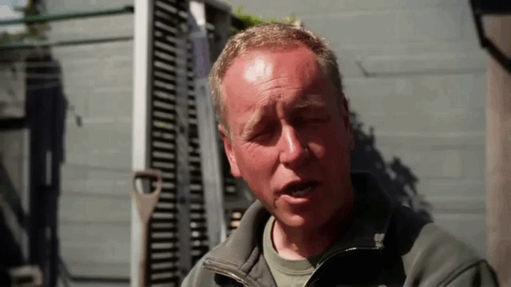

<div align="center">

<p align="center" style="border-radius: 10px">
  
</p>

<h1>MobileI2V: Fast and High-Resolution Image-to-Video on Mobile Devices</h1>


[Shuai Zhang](https://github.com/Shuaizhang7)<sup>\*</sup>, [Bao Tang](https://github.com/Tt-DAY)<sup>\*</sup>, Siyuan Yu<sup>\*</sup>, [Yueting Zhu](https://github.com/lazypomeloo), [Jingfeng Yao](https://github.com/JingfengYao),<br>Ya Zou, Shanglin Yuan, Li Yu, [Wenyu Liu](http://eic.hust.edu.cn/professor/liuwenyu), [Xinggang Wang](https://xwcv.github.io/index.htm)<sup>📧</sup>


Huazhong University of Science and Technology (HUST) 

(\* equal contribution, 📧 corresponding author)

[](https://github.com/hustvl/MobileI2V)
[](https://github.com/hustvl/MobileI2V)
[](https://github.com/hustvl/MobileI2V)

</div>

## 📰 News
- **[2025.11.27]** We have released our paper on [arXiv](https://arxiv.org/abs/2508.09136).

## 📄 Introduction
<div align="center">

</div>
Compared with SVD-XT (1.5B), our 5.55× smaller MobileI2V (0.27B) achieves similar generation quality, using only 2.24s on mobile and running 199× faster on an A100 GPU.

## 🎯 Demo

#### (1) 1280×720×17 Image to Video
<div align="center">
  
  
  
  
</div>

#### (2) 960×960×17 Image to Video
<div align="center">
  
  
  
  

</div>


## 🎯 How to Use

### Installation
You can install the required environment using the provided requirements.txt file. 

```
pip install -r requirements.txt
```
### Data Processing
There are many open source video datasets, such as [Openvid](https://github.com/NJU-PCALab/OpenVid-1M), [VFHQ](https://liangbinxie.github.io/projects/vfhq/) and [Celebv-text](https://github.com/CelebV-Text/CelebV-Text). The video should be cut into a fixed number of frames (such as 17 or 25...), and the video data should be filtered based on aesthetic (use [DOVER](https://github.com/VQAssessment/DOVER)) and optical flow scores.


You should organize your processed train data into a CSV file, as shown below:

```
video_path,text,num_frames,height,width,flow
./_JnC_Zj_P7s_22_0to190_extracted.mp4,scenery,17,720,1080,3.529723644
./_JnC_Zj_P7s_22_0to190_extracted.mp4,scenery,17,720,1080,4.014187813
```

### Train
You can use the provided ./train_scripts/train_i2v.sh script for training. The configuration file is located at: ./configs/mobilei2v_config/. Before training, change the corresponding model path.
```
bash ./train_scripts/train_i2v.sh
```

### Inference
You can use the provided ./test.sh script for inference. Provide a reference image or video (extract the first frame) to the asset/test.txt file and pass it to the --txt_file parameter.

```
CUDA_VISIBLE_DEVICES=0 python scripts/inference_i2v.py \
      --config=./configs/mobilei2v_config/MobileI2V_300M_img512.yaml \
      --save_path=humface_1126 \
      --model_path=./model/hybrid_371.pth \
      --txt_file=asset/test.txt \
      --flow_score=2.0 \
```


## 🎯 Mobile Demo
We designed the mobile UI and deployed the model, as shown in the video below:
<div align="center">
  

</div>

## ❤️ Acknowledgements

Our MobileI2V codes are mainly built with [SANA](https://github.com/NVlabs/Sana) and [LTX-Video](https://github.com/Lightricks/LTX-Video). Thanks for all these great works.


## 📝 Citation

If you find MobileI2V useful, please consider giving us a star 🌟 and citing it as follows:

```


```
